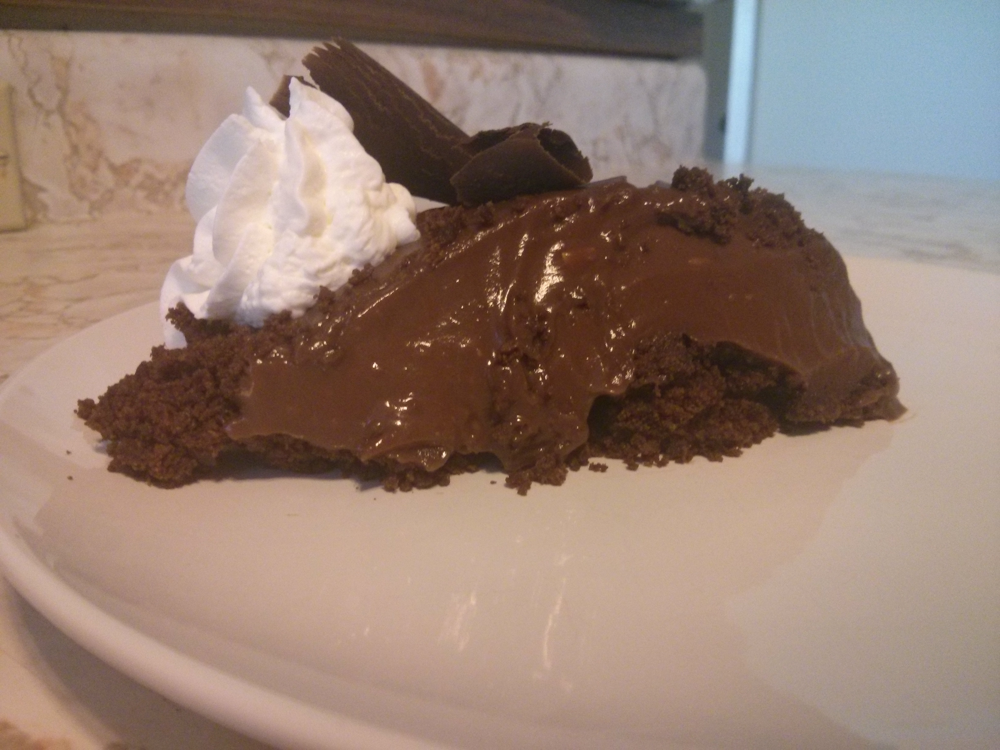
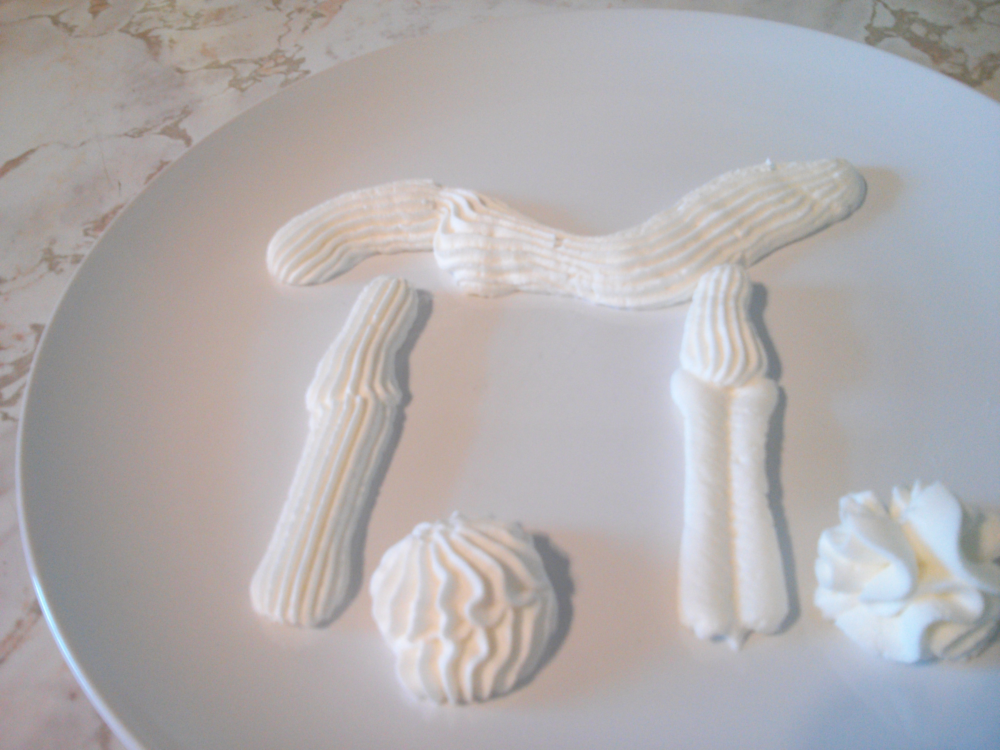

For Pi day I decided to try my hand at a chocolate pie. Part of the recipe called for chocolate curls, which was probably the hardest part of the whole recipe. At first I tried just using a knife to thinly slice from a bar of chocolate. That didn't work at all. The chocolate just crumbled. Then I stumbled across these instructions, which worked fairly well. My notes...

> * Refrigerate for at least 20 minutes after melting the chocolate. If it's still melty then when you try to make the curls they will stick to the knife.
> * The angle of the blade when you make the cut seems to be the most important factor for actually getting the chocolate to curl over. The blade should be as parallel as possible to the chocolate in order to get a good curl.
> * The pressure that you apply is also important. This is more of a balancing act because to little pressure will result in an unfinished curl and too much will just cut the chocolate in half. It seemed like starting with a little bit of pressure and slowly increasing it as you cut was the best approach.
> * Fun!

Happy Pi Day :)

It was delicious. [Recipe here](http://www.epicurious.com/recipes/food/views/black-bottom-chocolate-pie-102366).