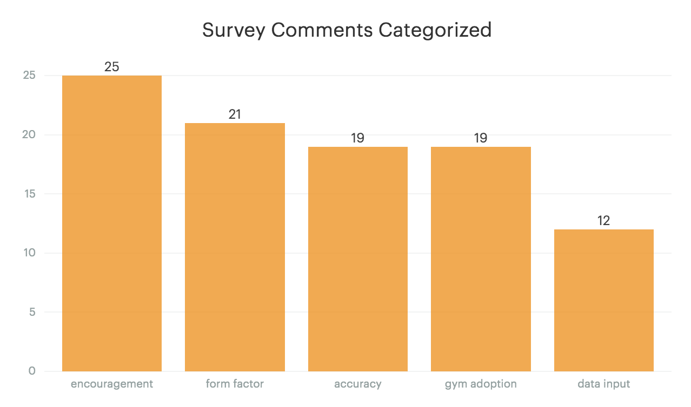
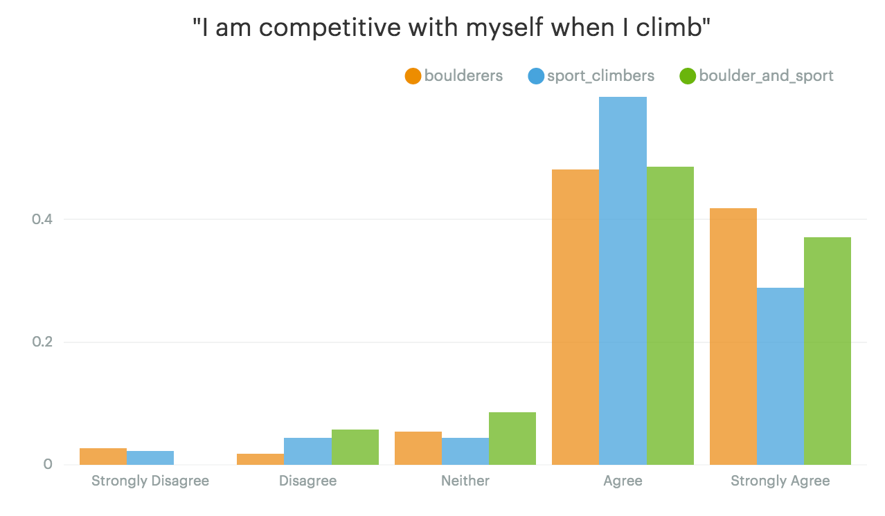
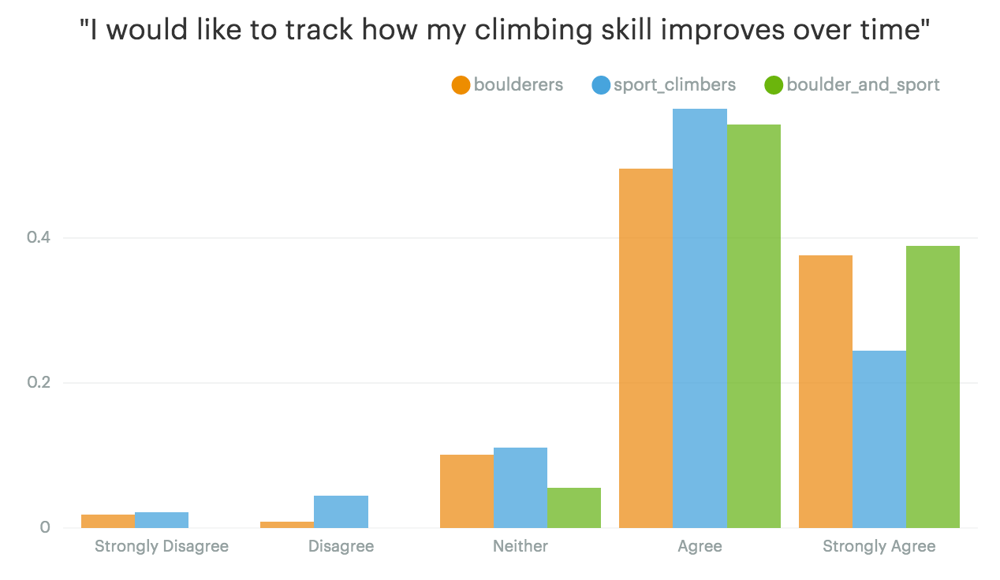
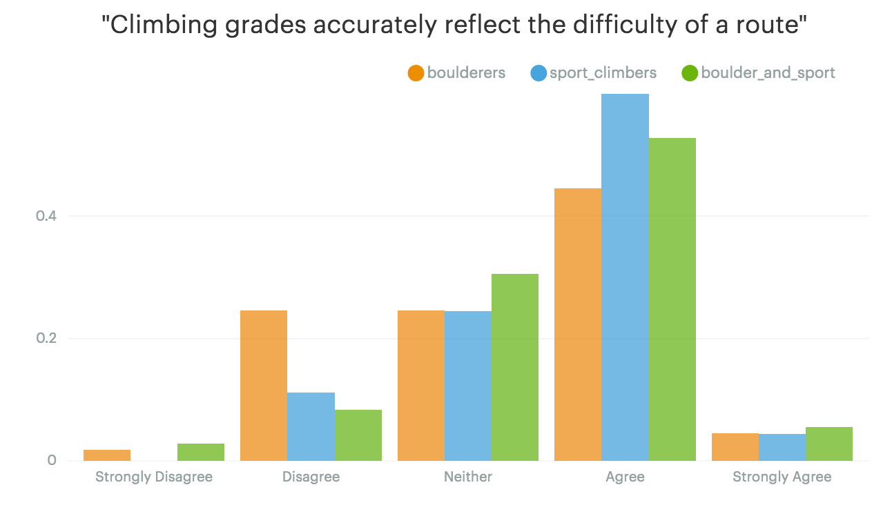
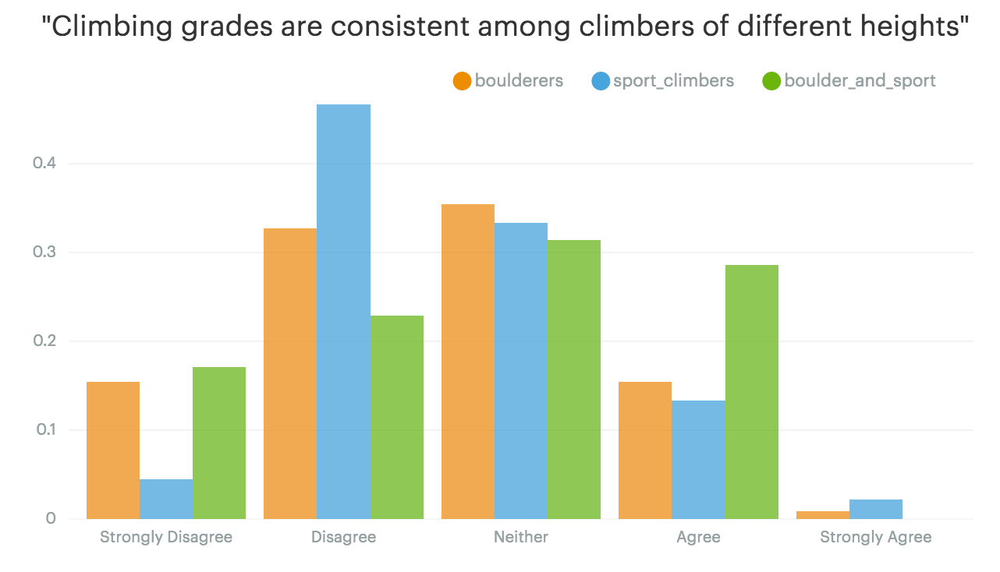
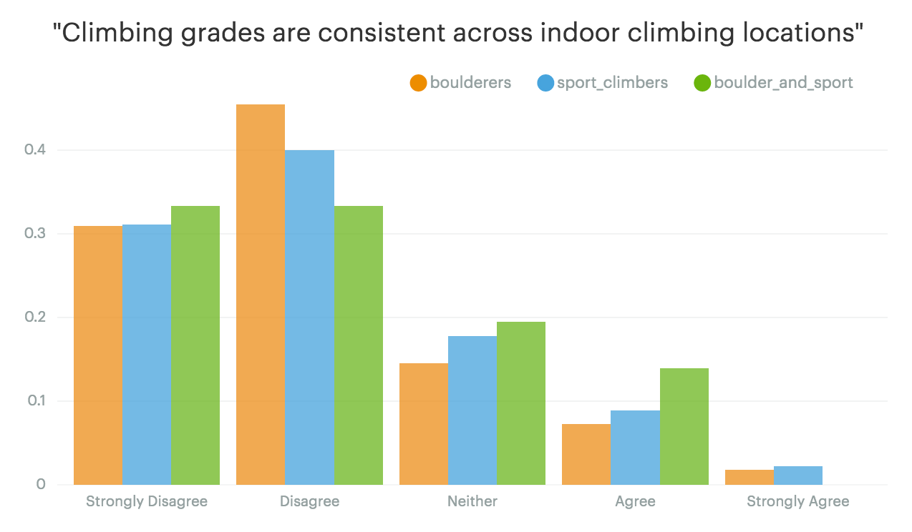

For a couple years I've been thinking about a kind of crazy idea related to my obsession with rock climbing. Three weeks ago I wrote it down folded it into a (metaphorical) paper airplane and [threw it into the world](https://www.reddit.com/r/climbing/comments/54qom7/hey_reddit_for_a_couple_years_ive_been_thinking/) to see if it would fly.

I believe that getting better at any skill requires dedication, and one of the biggest motivators for me is being able to see incremental progress. Certain activities lend themselves to seeing incremental progress but rock climbing isn't one of them.

Three weeks ago I suggested the idea of a **fitness tracker for rock climbers** (a la Fitbit) and shared it with my friends, Twitter followers and the Reddit climbing community. I put together a little survey and was hoping to get maybe 50 responses. I was totally floored when I came back to check my survey results and I had nearly 200 responses! Not only did you all fill out the survey, you gave me words of encouragement, offered to help, share your connections with climbing gyms, and suggested a ton of great features. I wanted to give you an update on where I am and where I'm going next, as well as share the data that I collected from your responses.

Out of all the information you shared with me, by far the most useful were your comments and concerns. I read through each one of them and categoriezed what you shared with me. Here are the results:

What surprised me here was that when I asked for what you were skeptical about, most of you shared words of encouragement. However, your concerns are incredibly valuable. Basically what I see here is a to-do list for me. Each one of these common concerns is a to-do item for me to validate before I move on. Over the next month I'll be working to address each one of these concerns.

## 1. The form factor

Is a Fitbit style wristband the right form factor for this device? Your most common concerns with the form factor were size and safety. Basically, this "thing" that I build cannot impede your wrist movement. Many of you shared that you don't wear any type of jewelery while climbing because it makes it harder to perform well and it's a safety hazard if it gets caught on a rock. I totally agree. Based on this feedback I'm thinking of adjusting the design so that it's less like a watch and more like the soft, snug type of sweat wristband (you know the kind that Tennis players wear?). The advantage of this form factor is twofold. First, it should give you more range of motion in your wrist than if you were wearing a watch. Second, if it gets caught on a rock it will just slip off your wrist, rather than causing an injury. I'd love your thoughts on this idea. I'm still not sure if this is technically feasible, so I'm continuing to investigate that.

## 2. Gym adoption

As you correctly identified, this idea is dead in the water if gyms don't sign on to support it. I'm doing everything I can to ensure that gyms barely have to modify their process at all in order to support the wristband. It may take them 3 - 5 extra minutes to set a route, but in the grand scheme of things that seems pretty small. I'm also looking to speak with as many route setters as I can over the next month to validate that they would be willing to implement something like this. If you are a setter, or you know any setters I would love to talk to you about this. I'm also working to chat with some setters at my local gyms here in Austin.

## 3. Accuracy

The thing I've spent most of my time doing over the last three weeks is talking to electrical engineers who have experience building this type of product. The common thread is that the idea is not as crazy as I originally thought. I'm in the process of vetting a few different candidates to see if we can build a smaller prototype that can be beta tested with a few climbers. It will take time, but it's totally doable. RFID is extremely accurate and is used for lots of other purposes including tracking inventory within a store and keeping track of where different medications go within a hospital. I won't know for sure until I have the next prototype built, but I'm confident this device could track your climbs more accurately than a Fitbit can track your steps. If you think your gym would be interested in beta testing I'd love to chat about it.

## 4. Data input

A handful of you were concerned that there would be a lot of data input for you as the climber. I wanted to clear that up. The idea is that the wristband will track everything automatically and sync it to an app on your phone. You won't have to do anything other than wear the wristband and connect it once to your phone. Then your stats will roll in.

If you're interested in chatting with me about any of these things above or anything else related to the project feel free to shoot me an email (anlarner@gmail.com).

If you're a Reddit user you can also [join the discusssion on Reddit]()

## If you're a data nerd like me, here are some other results from the survey I put out

