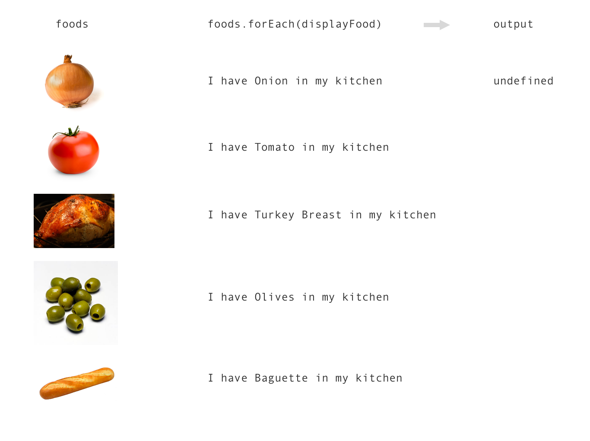
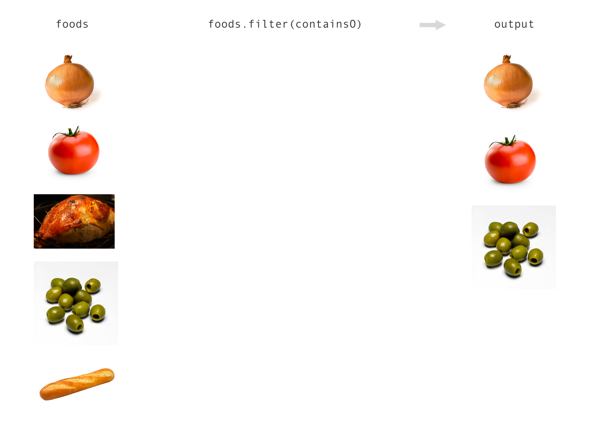
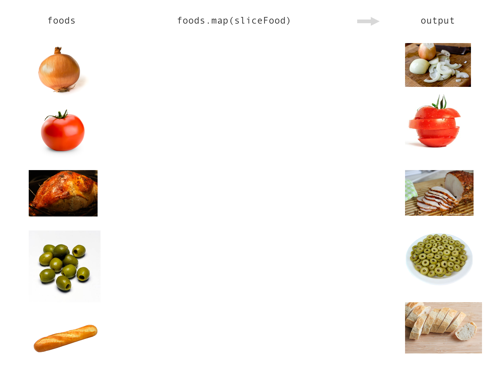

# What is the difference between map, filter, and forEach and when should they be used?

forEach, filter and map methods are used when I want to run some code once for each item in an array. There are four things we need to keep track of when using these array methods:

1. The original array
2. The method
3. The code that we want to run for each item in the array
4. The new array or output

Let's assume we have an array of food:

```js
var foods = ['Onion', 'Tomato', 'Turkey Breast', 'Olives', 'Baguette'];
```

In this case `foods` is our original array (1). Below is an example of each of our array methods being used on the foods array.
​
### forEach

​forEach is used when we want to run our code (3) once for each element in the original array (1) but we don't wish to create a new array (4).

```js
function displayFood(food) {
    console.log('I have '+food+' in my kitchen');
}
var output = foods.forEach(displayFood);
```



In this case we will get the following text logged to the console:

```
I have Onion in my kitchen
I have Tomato in my kitchen
I have Turkey Breast in my kitchen
I have Olives in my kitchen
I have Baguette in my kitchen
```
​
In this example let's list out the different pieces:

1. The original array: foods
2. The method: forEach
3. The code that we want to run for each item: displayFood
4. The new array or output: output

The ​forEach method will not give us any output, so our output variable will be _undefined_. forEach will never return any output.

### filter

filter is used when we want to run our code (3) once per element in the original array (1) and when we want our new array to include some, but not necessarily all of elements (foods in our case) in the original array. In other words, the filter method will create a new array with some of the elements filtered out of our original array.

```js
function containsO(food) {
    food = food.toLowerCase();
    if(food.indexOf('o') === -1) {
        return false;
    }
    else {
        return true;
    }
}
var foodsWithO = foods.filter(containsO);
```



In this case we will not get anything logged to the console, but our output (4) will be an _array_, not _undefined_ like in the case of the forEach example above. The way that filter (2) works, if the code that we want to run (3) returns true (or anything that is truthy), the element will be included in our new array. If it does not return true or a truthy value, the element will not be included in our new array (4).

In this example let's list out the different pieces:

1. The original array: foods
2. The method: filter
3. The code that we want to run for each item: containsO
4. The new array or output: foodsWithO

The filter method will give us output. In this case our output will be foodsWithO, and it will contain each item in the original array (1) that has an "o" in it's name.

```js
console.log(foodsWithO); // ['Onion', 'Tomato', 'Olives']
```

### map

map is used when we want to convert our original array into a new array with the same number of elements, but different values for those elements. For example, if we want to convert our list of raw foods into a list of sliced up foods.

```js
function sliceFood(food) {
	return 'Sliced '+food;
}
var slicedFoods = foods.map(sliceFood);
```



In this case we will not get anything logged to the console, but our output (4) will be an _array_, not _undefined_ like in the case of the forEach example above. The way that map (2) works is that whatever gets returned from the code we want to run (3) will be included in the new array (output). Furthermore, the new array will appear in the same order as the original array.

In this example let's list out the different pieces:
​
1. The original array: foods
2. The method: map
3. The code that we want to run for each item: sliceFood
4. The new array or output: slicedFoods

The map method will give us output. In this case our output will be slicedFoods, and it will contain each item in the original array but with the word 'Sliced' in front.

```js
console.log(slicedFoods);
// ['Sliced Onion', 'Sliced Tomato', 'Sliced Turkey Breast', 'Sliced Olives', 'Sliced Baguette'];
```