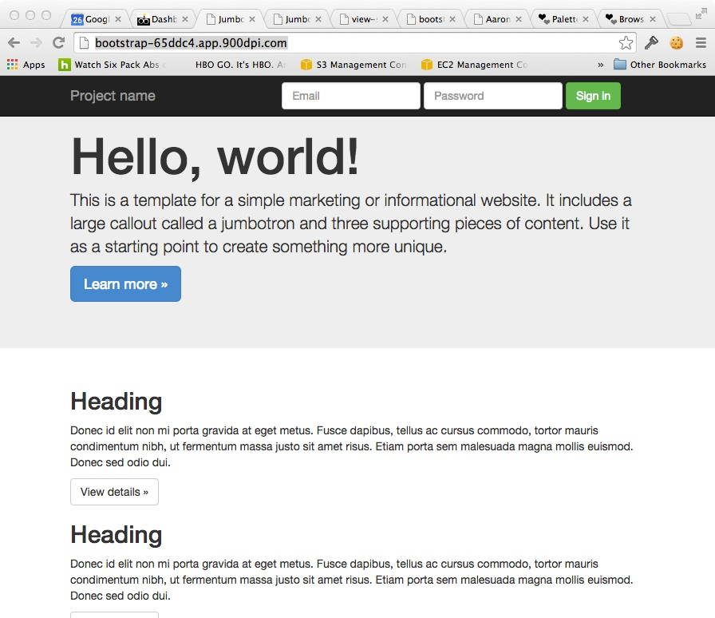
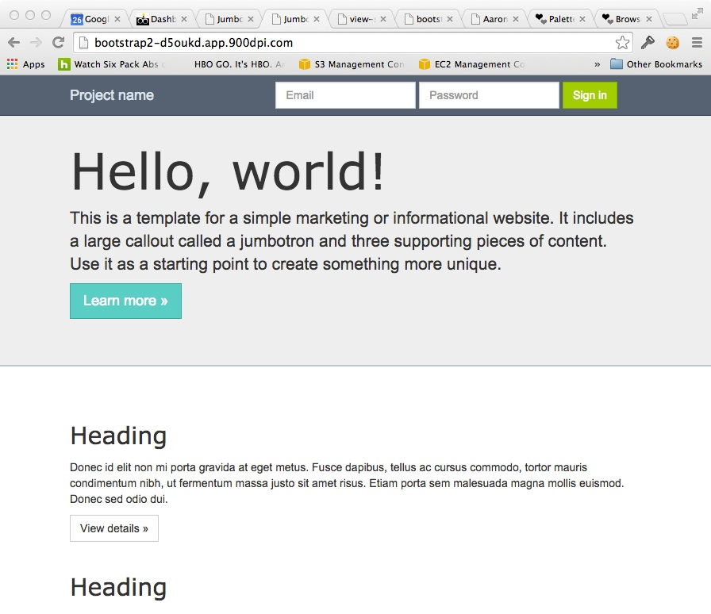

I'm going to give it to you straight people of the internet. I'm sick and tired of seeing Bootstrap everywhere I look. Don't get me wrong, Bootstrap is a great tool and I use it a lot, but there is no excuse for every single one of your websites to look like the default Boostrap theme. So today is your lucky day. I'm going to give you four dead simple things that you can do to make your new Bootstrap website look less like it was made with Bootstrap.

<blockquote class="twitter-tweet" data-lang="en"><p lang="en" dir="ltr">I like that the Madison Capitals ticket website is just the default bootstrap template <a href="https://t.co/kwuV42g5GN">https://t.co/kwuV42g5GN</a></p>&mdash; Mark Olschesky (@markolschesky) <a href="https://twitter.com/markolschesky/status/522824523935014912">October 16, 2014</a></blockquote>
<script async src="//platform.twitter.com/widgets.js" charset="utf-8"></script>

## 1. Get rid of form-control focus glow. 

Seriously... I cringe every time I see this. I don't really understand why it was put there in the first place, but luckily it's dead simple to remove: 

```css
.form-control:focus {
	border-color: #999;
	outline: 0;
	-webkit-box-shadow: none;
	box-shadow: none;
}
```

## 2. Change the border radius for form elements and buttons. 

Make it bigger, make it smaller, get rid of it entirely, I don't care. The entire internet doesn't need a 4px border radius. 

```css
.form-control .btn {
	border-radius: 0;
}
```

## 3. Give your headers a little style.

Maybe change the font, font size or some of the padding/margins. 

```css
h1, h2, h3 {
	margin-top: 40px;
	margin-bottom: 14px;
	font-family: Verdana,sans-serif;
}
```

## 4. Pick a new color theme. 

Head over to [coulourlovers.com](http://www.colourlovers.com/palettes) and pick a nice looking pallete. For this example I opted for ["cheer up emo kid."](http://www.colourlovers.com/palette/1930/cheer_up_emo_kid) If you're design challenged like me here are some general rules of thumb: For each button type (default, primary, success, etc.) pick a color from your coulourlovers theme.

> * The background color of the button should be that color.
> * The border should be 20% darker than the color (use SASS).
> * The :hover, :active, and :focus states background color should also be 20% darker than the base color.
> * The border radius for these states should be 40% darker than the base color.The text color should be 75% lighter or 75% darker than the base color, > * depending on your style.

That's it. Here's an example I threw together in 15 minutes and a [stylesheet](https://gist.github.com/alarner/ddad3e8bd137398aec62) for you to use as a starting point.

### Before



### After

